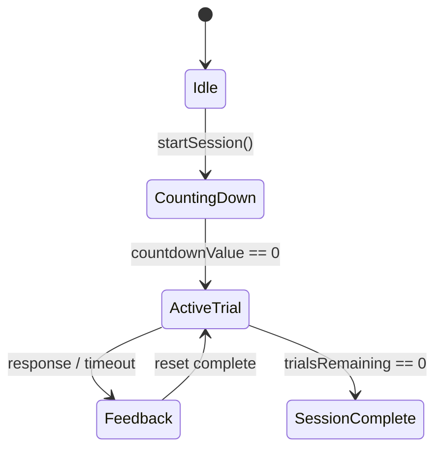

# Data Model & State Transitions: Game Start Countdown

## State Updates

### FlankerSessionState / TaskSwitchState
- **`isCountingDown`**: `bool` (default: `false`)
- **`countdownValue`**: `int` (default: `0`)

## State Transitions

### Transition Logic
- **CountingDown**: 
    - Entered when `startSession` is called.
    - Decrements every 1000ms.
    - `isCountingDown` remains `true`.
- **ActiveTrial**:
    - Triggered by `countdownValue` hitting 0.
    - Sets `isCountingDown` to `false`.
    - Generates and displays the first stimulus.
