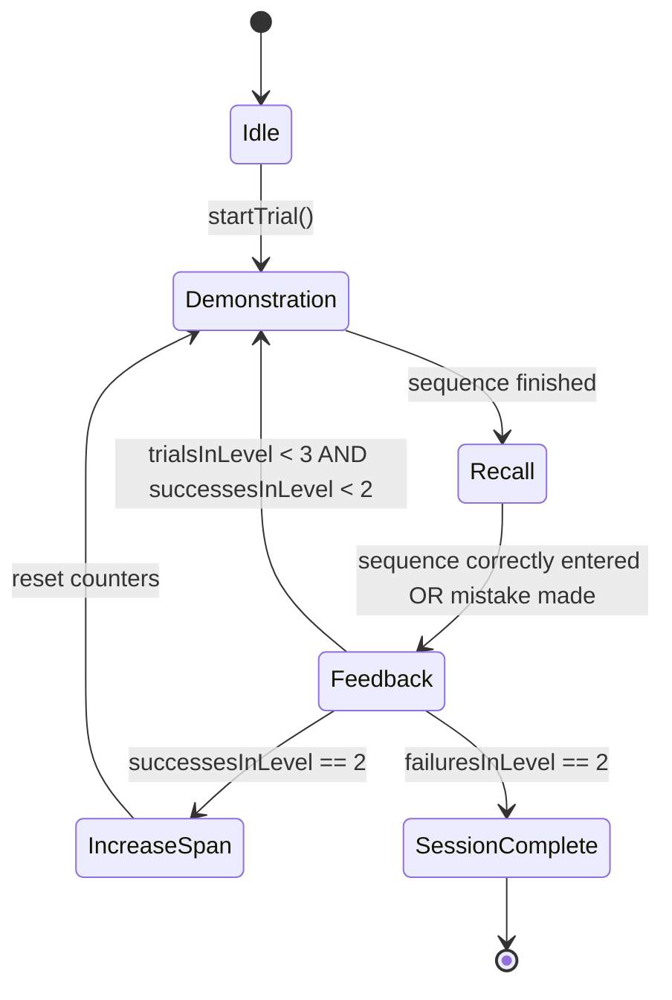

# Data Model & State Transitions: Spatial Span Game Milestone 1

## State Models

### SpatialSpanState
- **`span`**: `int` (The current number of shards in the sequence).
- **`trialsInLevel`**: `int` (Number of trials attempted at the current span).
- **`successesInLevel`**: `int` (Number of successful trials at the current span).
- **`currentSequence`**: `List<int>` (Indices of shards in the demonstration sequence).
- **`userSequence`**: `List<int>` (Indices of shards tapped by the user).
- **`phase`**: `GamePhase` (Enum: `idle`, `demonstration`, `recall`, `feedback`, `complete`).
- **`activeShardIndex`**: `int?` (Index of the shard currently pulsing in demonstration).

## State Transitions

### Transition Logic (2-out-of-3)
- If `userSequence` matches `currentSequence`: `successesInLevel++`.
- If `successesInLevel == 2`: Level up (`span++`), reset `trialsInLevel` and `successesInLevel`.
- If `trialsInLevel - successesInLevel == 2`: Terminate session.

## Constants
- **Demonstration Interval**: 1000ms.
- **Feedback Duration**: 500ms.
- **Grid Layout**: 3x3 Randomized Bounding Box.
