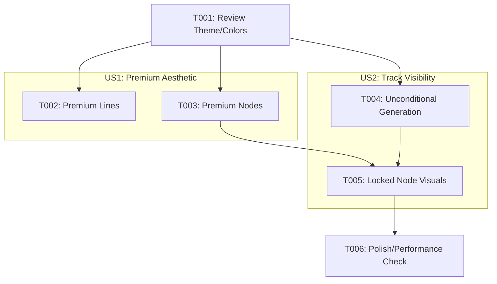

# Implementation Tasks: Premium Progression Map

**Feature**: Premium Progression Map (from `plan.md` and `spec.md`)

## Phase 1: Setup

*(No infrastructure setup required; project is already initialized with Flutter and Riverpod)*

## Phase 2: Foundational Prerequisites

- [ ] T001 Review `AppTheme` and `ProgressionMapPainter` in `lib/widgets/backgrounds/progression_map_painter.dart` to ensure track colors (Neon Blue, Pink, Lime) are correctly mapped for the new gradient logic.

## Phase 3: User Story 1 - Premium Aesthetic for Progression Map

**Goal**: Elevate the UI to a premium level using gradients, glows, and dimensional rendering for nodes and lines.
**Independent Test Criteria**: Lines connecting nodes and the nodes themselves feature rich gradients and blurs instead of flat 2D coloring.

- [x] T002 [US1] Update `_drawLines` method in `lib/widgets/backgrounds/progression_map_painter.dart` to replace solid `Paint` with a `LinearGradient` shader and outer glow `MaskFilter.blur` for premium line styling.
- [x] T003 [US1] Refactor node drawing loop in `paint` method of `lib/widgets/backgrounds/progression_map_painter.dart` to render `ConstellationNode` with dimensional inner gradients and outer blurs matching their respective track colors.

## Phase 4: User Story 2 - Full Track Visibility on First Open

**Goal**: Show all 3 available tracks on the progression map even when locked, enabling better discoverability.
**Independent Test Criteria**: A new user with no progress sees 3 parallel tracks on the Progression Map, with Tracks 2 and 3 visible but dimmed/locked.

- [x] T004 [P] [US2] Modify `_generateNodes` in `lib/screens/progression_map_screen.dart` to unconditionally generate nodes for all 3 tracks by removing `track2Visible` and `track3Visible` conditional blocks.
- [x] T005 [US2] Update node rendering in `lib/widgets/backgrounds/progression_map_painter.dart` to apply a dimmed, low-opacity, glowless visual state when `node.isUnlocked` is false.

## Phase 5: Polish & Cross-Cutting Concerns

- [x] T006 Ensure scroll and pan performance remains smooth (60fps target) in `ProgressionMapScreen` after adding new shaders and blurs to the background painter.

---

## Dependencies & Execution Order

## Parallel Execution Examples

- **Example**: Task `T004` (updating `_generateNodes` logic in `progression_map_screen.dart`) can be executed in parallel with `T002` and `T003` (updating painting aesthetics in `progression_map_painter.dart`), as they operate on different structural files.

## Implementation Strategy

- **MVP Delivery**: Complete User Story 1 (T002, T003) first to establish the baseline premium aesthetics for the primary (unlocked) nodes.
- **Incremental Enhancement**: Once the premium aesthetics are in place, introduce the unconditional generation (T004) and map the locked aesthetic (T005) over the new premium nodes.
